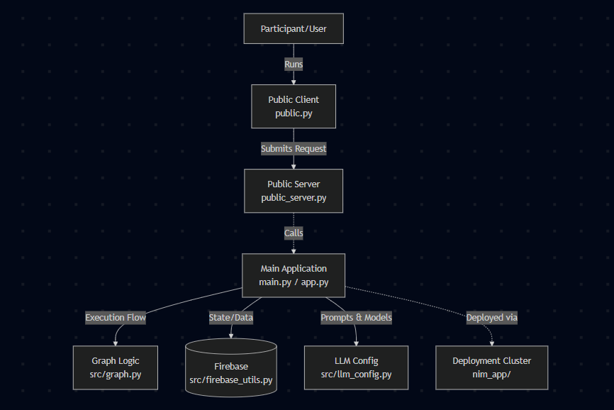
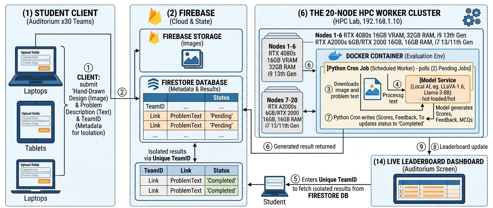

# Multi Agentic Competition Evaluation Engine

Thank you for attending the SSD Workshop! This repository contains the sample code and resources for our session. Here you'll find everything you need to set up, run, and understand the project architecture.

> [!NOTE]
> We initially designed our system to deploy this in our college HPC lab, but due to less time we moved to a cloud approach.

## 🏗 Architecture Diagram



## 📂 Folder Structure

```text
.
├── app.py                  # Secondary entry point (e.g., UI or alternative server)
├── main.py                 # Main application script
├── requirements.txt        # Python dependencies
├── nim_app/                # Deployment and cluster configuration
│   ├── CLUSTER_GUIDE.md
│   ├── deploy_gateway.sh
│   ├── deploy_nim.sh
│   ├── main.py
│   └── nginx/              # NGINX configuration
├── public/                 # Client/Server public-facing scripts
│   ├── public.py           # Client script
│   └── public_server.py    # Server script
└── src/                    # Core source code and utilities
    ├── firebase_utils.py   # Firebase connection utilities
    ├── graph.py            # Core application logic and flow
    └── llm_config.py       # LLM templates and setup
```

## 📁 Folder Contents Explained

*   **Root (`/`)**: Contains the primary application entry points (`app.py`, `main.py`) and the list of project dependencies (`requirements.txt`).
*   **`public/`**: Contains the client/server implementation. **If you want to run a client/server architecture during the workshop, use this folder.** Run `public_server.py` to start the backend, and ask your users/participants to run `public.py` to submit their requests.
*   **`src/`**: The brain of the application. 
    *   `firebase_utils.py`: Manages database operations.
    *   `graph.py`: Contains the core application graphs and logic flows.
    *   **👉 Prompt Templates**: Check out **`src/llm_config.py`** to find and modify the prompt templates used by the AI models behind the scenes!
*   **`nim_app/`**: Our dedicated cluster deployment package. (See below for details)

### 🖥️ Deep Dive: The `nim_app/` Folder (Standalone Deployment)



The `nim_app/` directory is designed to work completely independently from the core local application. It encapsulates the production infrastructure code intended for scaling (e.g., in an HPC cluster or cloud environment using NVIDIA Inference Microservices - NIM). 

Here is how it works under the hood:
*   **Gateway & Routing**: Uses `nginx/nginx.conf` to configure an NGINX load balancer / reverse proxy to route traffic smoothly.
*   **Deployment Scripts**: Bash scripts (`deploy_gateway.sh` and `deploy_nim.sh`) to automate the spinning up of the gateway and inference microservices node by node.
*   **Independent Entry Point (`main.py`)**: Includes a specialized `main.py` tailored specifically for the cluster gateway rather than the local client/server loop.

> [!IMPORTANT]
> You only need to work within the `nim_app/` folder if you are deploying the architecture to an HPC cluster or cloud instances. For local testing, prompt tweaking, and workshop participation, you can safely ignore it and just use the `public/` and `src/` folders!

## 🚀 Setup Instructions

1. **Clone the repository:**
   ```bash
   git clone <repository-url>
   cd <repository-directory>
   ```

2. **Create and activate a virtual environment (Recommended):**
   ```bash
   python -m venv venv
   
   # On Windows:
   venv\Scripts\activate
   # On macOS/Linux:
   source venv/bin/activate
   ```

3. **Set up Environment Variables:**
   Copy the provided `.env.example` file to create your local `.env` configuration:
   ```bash
   cp .env.example .env
   ```
   Open the `.env` file and fill in your respective API keys. 

   > [!TIP]
   > **About LangChain Tracing & LangSmith (Recommended)**
   > This project uses **LangChain Tracing** via **LangSmith** to help you understand your AI's thought process under the hood:
   > * **LangChain Tracing** logs every step of a complex agent's execution. It captures exactly what prompts go into the models and the raw output that comes back.
   > * **LangSmith** is the visual web dashboard where you can easily inspect, debug, evaluate, and monitor those traces in real-time.
   > 
   > To link your project to your dashboard, just ensure `LANGCHAIN_TRACING_V2=true` in your `.env` and fill in your `LANGCHAIN_API_KEY`.

4. **Install dependencies:**
   ```bash
   pip install -r requirements.txt
   ```

5. **Start the Public Server (Backend):**
   ```bash
   python public/public_server.py
   ```

6. **Run the Client (Participants):**
   ```bash
   python public/public.py
   ```

## 🤝 Contributing

Feel free to contribute! If you have any improvements, updated prompt templates, or cool new features you built during the workshop, please feel free to open a Pull Request or create an Issue. Let's build together!
